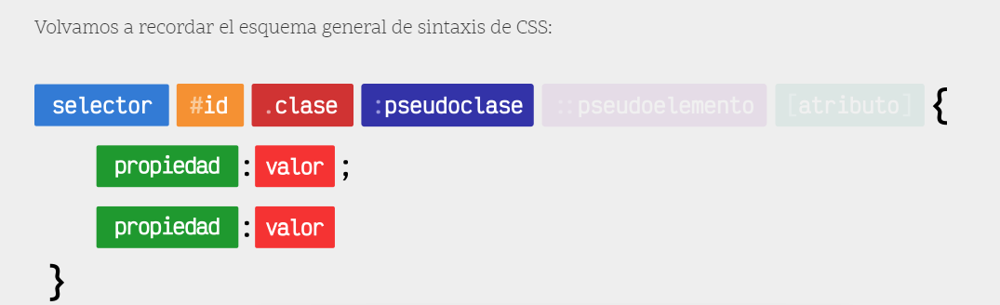

# Clase CSS 

Este es material para dar la primera clase de CSS.

## Brief 🗺️
  > La idea de esta clase es que sea interactiva logrando crear un diseño de una página web sencilla y que puedas explicar los temas siguientes temas: 

  - Manejo de estilos de un documento HTML con CSS
  - Consulta y uso de la documentación oficial
  - Cómo vincular CSS con HTML
  - Selectores
  - Uso de estilos básicos
  - Box model
  - Float
  - Position
  - CSS3 Flexbox
  - CSS3 Grid
  - Diseño Responsivo
  - Media Queries

 * * *
 

### ⬆️⬆️⬆️ El Material de clase, se encuentra en la carpeta de __proyecto__ dentro de este folder ⬆️⬆️⬆️

> __El desafío del alumno es dar estilos a un sito web previmente "ensamblado" con una estructura HTML.__


  * * * 

## My process 🚀

## __⚠️ Antes de empezar es importante haber visto los temas antes descritos de forma aislada__

### Como empezar

  Puedes iniciar el proyecto añadiendo la carpeta de __proyecto__ en tu github para que los alumnos puedan seguir practicando el uso de GitHub.
  
  Es recomendable omitir subir el archivo: 
  - __styles.css__
  
  y dentro del hmtl omite el bloque de form para que se pueda explicar mas adelante.

* * *

El index ya está totalmente maquetado y listo para ser usado, puedes usar los estilos ya definidos 😎.

La idea es explicar el uso de css, paso a paso mientras vas maquetando el sitio, en este proyecto ya esta el styles.css, te recomiendo que este archivo no se comparta con los alumnos, si no crearlo mientas se va dando la clase

El Archivo styles.css es muy completo: recuerda explicar la estructura de css y los estilos básicos.



  Contiene temas mas "avanzados" como: 

  - pseudoclase :root
  - box-sizing: inherit;
  - selectores

  Si quieres documentarte mas puedes usar el siguiente recurso, incluye diagramas y explicación 100% en español:

  - [Lenguaje CSS ](https://lenguajecss.com/)

* * *

##  explicación de Formulario: 

El formulario debe ir dentro del bloque __"div class="form-container"__

  ```html

    <form>
        <label>Email</label>
        <input
          class="input-form"
          placeholder="micorreo@email.com" 
          type="email"
          id="email"
          name="email"
          />          
        <label>Nombre Completo</label>
        <input 
          class="input-form"
          placeholder="Carlos Chavez" 
          type="text"
          id="name"
          name="name"
        />
        <label>Comentarios</label>
        <textarea
          class="input-form"
          rows="5"
          cols="50"
        >Déjanos todas tus dudas aquí</textarea>
        <div class="center-container">
          <button type="submit"  class="btn-login">Sign Up</button>
        </div>
      </form>

  ```

  En esta parte es recomendable ir creando el siguiente formulario, para que puedas explicar línea por línea 🚀🚀🚀

  Puedes explicar que es: 
  - __label__
  - __input__
  - __textarea__
  - __button__ y su funcionamiento
  - __placeholder__
  - __type__

* * *

### Notas Finales 📝

  > Como puedes ver, el proyecto propone crear una clase en la que los alumnos puedan seguir, crear, interactuar y replicar un proyecto base de html

  > Las medidas usadas en css son en pixeles, esto con la finalidad de no complicar la explicación y términos usados para la gente que no tiene experiencia en CSS o temas de diseño.

  > 💡 También se puede combinar esta clase con temas de GitHub y GitHub Pages, llevando al alumno a crear un repositorio y la página propuesta. 

 > Esté proyecto fue obtenido de FRONTEND MENTOR [LINK](https://www.frontendmentor.io)
 


