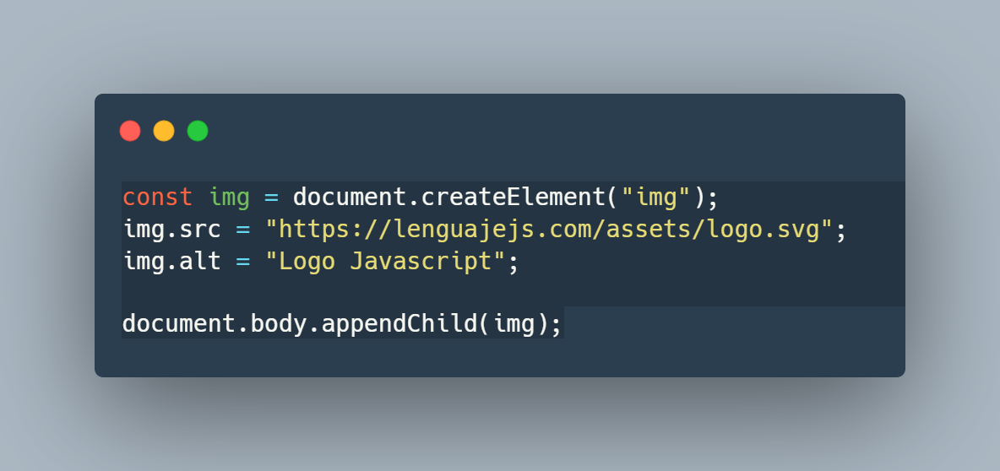
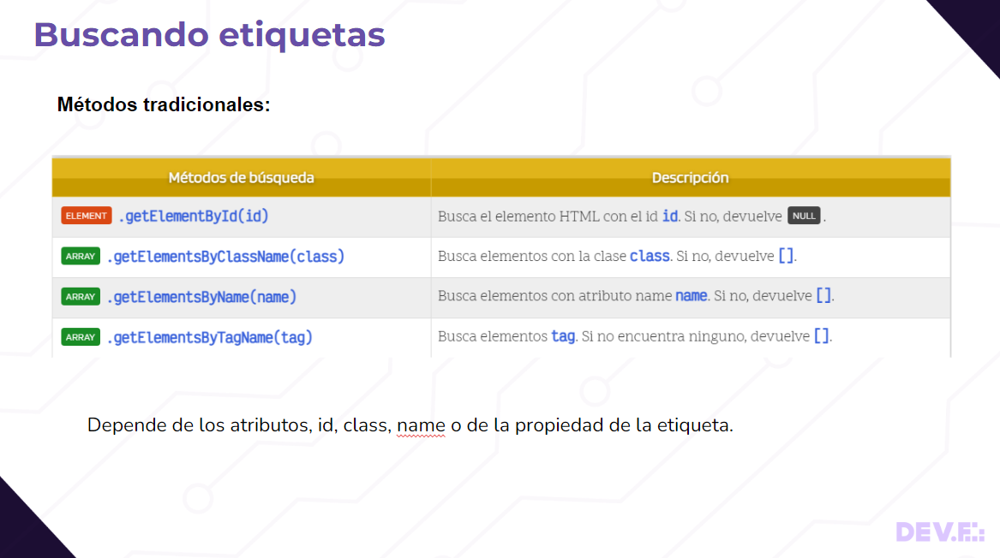
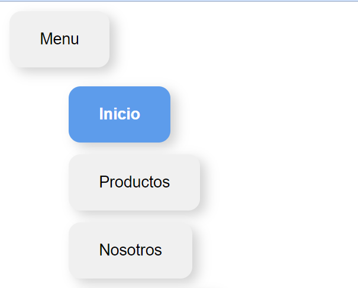

# DOM

Este es material para dar la primera clase de HTML.

## Brief 🗺️
  > Temas a tratar en esta clase:

  - ¿Qué es el DOM?
  - Seleccionar elementos del DOM
  - Crear elementos del DOM
  - Insertar elementos del DOM
  - Objeto ClasList
  - Nevegando entre elementos del DOM
  - Eventos del DOM
  - Objeto Event

 * * *
 

### ⬆️⬆️⬆️ Presentación en la carpeta  ⬆️⬆️⬆️
  * * * 

## La clase 🚀

La Presentación cuenta con tablas y ejemplos de código para que el alumno pueda entender los temas a tratar.

Y tablas con recuros para que el alumno pueda investigar más sobre el tema.

  
* * *

### Reto de clase
 El reto de la clase consiste en crear un menu sensillo con HTML, CSS y __usando eventos del DOM__

> el reto de resuelto esta en la carpeta `reto` de esta clase.

* * *

### Notas Finales 📝

  > Como puedes ver, el proyecto propone crear una clase en la que los alumnos puedan seguir, crear, interactuar y replicar un proyecto base de html

  > Las medidas usadas en css son en pixeles, esto con la finalidad de no complicar la explicación y terminos usados para la gente que no tiene experiencia en CSS o temas de diseño.

  > 💡 También se puede combinar esta clase con temas de GitHub y GitHub Pages, llevando al alumno a crear un repositorio y la página propuesta. 

 
